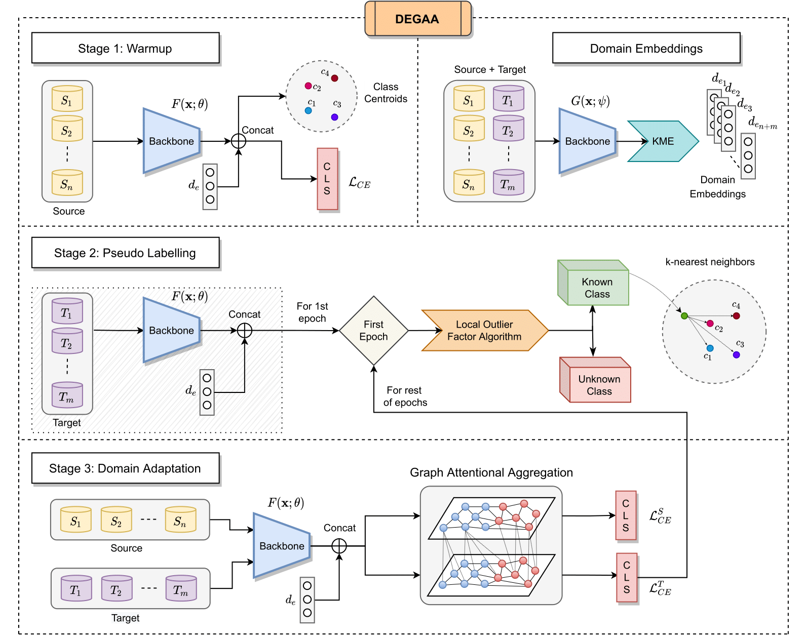

## Authors

[Rohit Lal](http://rohitlal.net/)<sup>1</sup>, [Arihant Gaur]()<sup>2</sup>, [Aadhithya Iyer]()<sup>2</sup>, [Muhammed Abdullah Shaikh]()<sup>2</sup> and [Ritik Agrawal]()<sup>2</sup>

<sup>1</sup>1
Indian Institute of Science (IISc), Bangalore
<sup>2</sup>Visvesvaraya National Institute of Technology (VNIT), Nagpur


## Abstract

Single-Source Single-Target Domain Adaptation (*`1`S`1`T*) aims to
bridge the gap between a labelled source domain and an unlabelled target
domain. Despite *`1`S`1`T* being a well-researched topic, they are
typically not deployed to the real world. Methods like Multi-Source
Domain Adaptation and Multi-Target Domain Adaptation have evolved to
model real-world problems but still do not generalise well. The fact
that most of these methods assume a common label-set between source and
target is very restrictive. Recent Open-Set Domain Adaptation methods
handle unknown target labels but fail to generalise in multiple domains.
To overcome these difficulties, first, we propose a novel generic domain
adaptation (DA) setting named Open-Set Multi-Source Multi-Target Domain
Adaptation (*OS-nSmT*), with *n* and *m* being number of source and
target domains respectively. Next, we propose a graph attention based
framework named DEGAA which can capture information from multiple source
and target domains without knowing the exact label-set of the target. We
argue that our method, though offered for multiple sources and multiple
targets, can also be agnostic to various other DA settings. To check the
robustness and versatility of DEGAA, we put forward ample experiments
and ablation studies.

## Architecture


## Algorithm


## BibTex

If you find our work useful please cite our paper.
```
@InProceedings{Lal_2021_NeurIPS,
    author    = {Lal, Rohit and Gaur, Arihant and Iyer, Aadhithya and Shaikh, Muhammed Abdullah and Agrawal, Ritik},
    title     = {Open-Set Multi-Source Multi-Target Domain Adaptation},
    month     = {December},
    year      = {2021}
}
```
